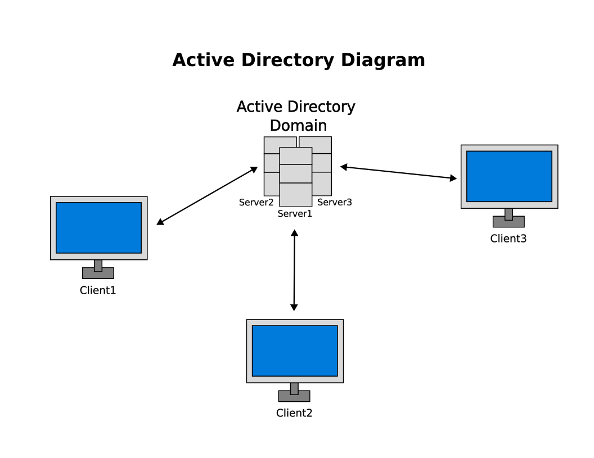

# Introduction to Active Directory
**Active Directory** (**AD**) is a directory service developed by Microsoft for Windows domain networks. A **directory service** maps the names of network resources to their respective network addresses.

A **domain controller** is a server running the **Active Directory Domain Services** (**AD** **DS**) as its role. It authenticates and authorizes all users in a Windows domain-type network by assigning and enforcing security policies for all computers. It can install or update software for these computers.

A **directory** is a hierarchical structure that stores information about objects on the network. A directory service like **Active Directory Domain Services** (**AD DS**) provides the methods for storing directory data and making this data accessible on the network with users and administrators.

Active Directory stores information about objects on the network; this makes it straightforward for administrators and users to find and use this information. Active Directory uses a structured **data store** as the basis for a logical and hierarchical organization of directory information.

Active Directory uses **Lightweight Directory Access Protocol** (**LDAP**), **Kerberos**, and **DNS**. The **Lightweight Directory Access Protocol** (**LDAP**) is an open, vendor-neutral, industry standard application protocol for accessing and maintaining distributed directory information services over an **Internet Protocol** (**IP**) network. 

## Definitions
- **Active Directory** (**AD**): is a database or directory for Windows domain networks.
- The **database** (or **directory**) contains critical information about your environment, including what users and computers there are and who's allowed to do what.
- **Active Directory Domain Services** (**AD** **DS**): is a domain controller that authenticates and authorizes all users and computers in a Windows domain-type network.
- A **domain** **controller** is a server that responds to security authentication requests within a computer network domain.

## Active Directory includes
1. **Data store** (**directory**): contains information about objects such as users, groups, computers, domains, organization units, and security policies.
2. **Security**: uses logon authentication and access control objects in a directory
3. **Schema**: contains the definitions for all objects in the directory
4. **Global catalog**: contains the information about every object in the directory. This allows users and applications to find objects in an Active Directory domain tree, given one or more attributes of the target object.
5. **Query and index mechanism**: Enables you to find objects in the directory based on the selection criteria (query) and to retrieve specified properties for the objects found.
6. **Replication service**: distributes directory data across a network and all domain controllers in a domain participate in replication and contain a complete copy of all the directory information for their domain.

## Active Directory Diagram

## Resources
- [Active Directory Domain Services Overview - Microsoft](https://learn.microsoft.com/en-us/windows-server/identity/ad-ds/get-started/virtual-dc/active-directory-domain-services-overview) 
- [Searching in Active Directory Domain Services - Microsoft](https://learn.microsoft.com/en-us/windows/win32/ad/searching-in-active-directory-domain-services) 
- [Schema - Microsoft](https://learn.microsoft.com/en-us/previous-versions/windows/it-pro/windows-server-2003/cc756876(v=ws.10)) 
- [Global Catalog - Microsoft](https://learn.microsoft.com/en-us/windows/win32/ad/global-catalog)
- [Directory data store - Microsoft](https://learn.microsoft.com/en-us/previous-versions/windows/it-pro/windows-server-2003/cc736627(v=ws.10)) 
- [What is Active Directory? - Quest](https://www.quest.com/solutions/active-directory/what-is-active-directory.aspx#:~:text=Active%20Directory%20(AD)%20is%20a,who's%20allowed%20to%20do%20what)
- [Active Directory - Wikipedia](https://en.wikipedia.org/wiki/Active_Directory) 
- [Domain controller - Wikipedia](https://en.wikipedia.org/wiki/Domain_controller) 
- [Directory service - Wikipedia](https://en.wikipedia.org/wiki/Directory_service) 
- [Lightweight Directory Access Protocol - Wikipedia](https://en.wikipedia.org/wiki/Lightweight_Directory_Access_Protocol) 
- [What is Active Directory? A Beginner’s Guide - Active Directory Pro](https://activedirectorypro.com/what-is-active-directory/) 
- [Active Directory Diagram - ConceptDraw](https://www.conceptdraw.com/examples/active-directory-domain-services-diagram) 

